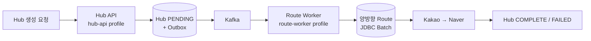

# 물류 이커머스 시스템 (백엔드 4인)

- 물류 허브와 허브 간 이동 경로, 상품 재고를 관리하는 서비스입니다.
- Java 21 · Spring Boot 3.5 · PostgreSQL 16 · Redis 7 · Kafka를 사용합니다.

## 담당

- Hub·HubRoute 생성 및 갱신 파이프라인

## Hub 생성·경로 구축 파이프라인



### Kafka 비동기화와 Outbox

- Hub와 `HubCreatedEvent` Outbox를 같은 Transaction에 저장하고 Commit 이후
  Kafka로 발행합니다.
- 발행 실패 이벤트는 Scheduler가 재시도하며, `event_key` UNIQUE 제약으로
  중복 저장을 방지합니다.
- 지도 API 100회·호출당 2,050ms 고정 지연 조건에서 Hub 생성 API 응답시간을
  `206,535ms → 12ms`로 단축했습니다. `12ms`는 Hub와 Outbox 저장까지의 시간입니다.

### Route Worker 프로세스 격리

- 같은 저장소에서 동일한 JAR·이미지를 빌드하고 `hub-api`, `route-worker`
  프로필로 각각 실행합니다.
- Hub 조회 API와 외부 API·경로 갱신 작업을 별도 JVM으로 분리해
  Thread·Heap·GC와 장애 전파 범위를 격리합니다.

```bash
SPRING_PROFILES_ACTIVE=dev,hub-api ./gradlew bootRun
SPRING_PROFILES_ACTIVE=dev,route-worker ./gradlew bootRun
```

### 경로 저장 최적화

- `ON CONFLICT DO NOTHING`과 UNIQUE 제약으로 Kafka 중복 소비에 의한 중복
  경로를 방지합니다.
- 경로 200건을 단일 Transaction과 JDBC `executeBatch()`로 저장해
  `235.1ms → 118.8ms → 9.97ms`로 단축했습니다.

### 외부 지도 API 장애 대응

- Naver API 응답시간을 측정해 Connect Timeout `1초`, Read Timeout `4초`를
  초기값으로 설정했습니다.
- Timeout·연결 실패·5xx는 Kakao를 지연 재시도하고, 반복 실패나 Circuit
  Breaker OPEN 시 Naver로 전환합니다.
- 공급자별 Redis Token Bucket으로 호출량을 제한하고, 두 공급자 모두
  일시 장애이면 Backoff·Jitter 기반으로 지연 재시도합니다.
