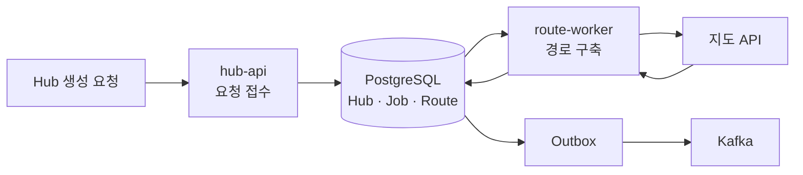
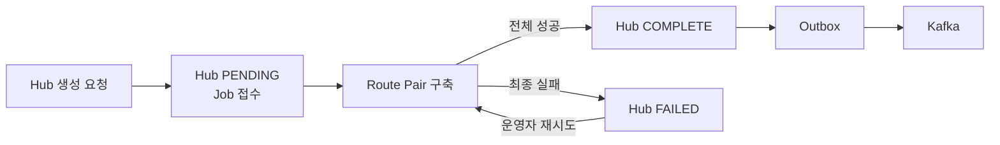
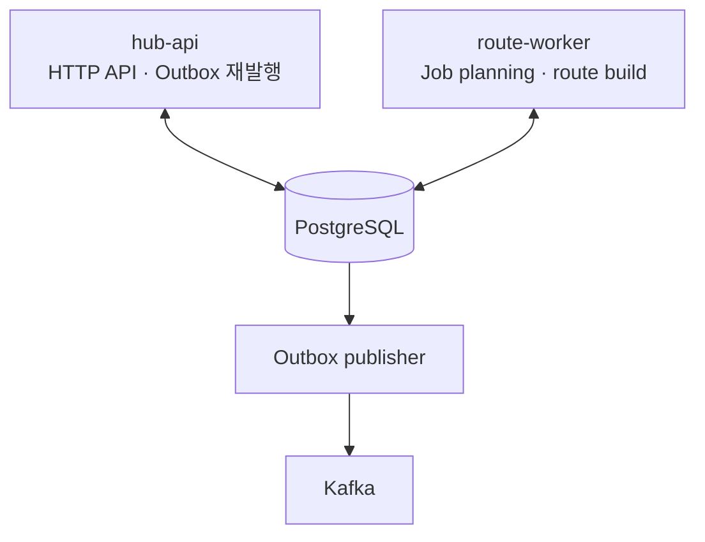

# 물류 이커머스 시스템

- 범위: 물류 허브·허브 간 이동 경로·상품 재고 관리
- 담당: Hub·HubRoute 생성·갱신 파이프라인
- 구현: DB Job 기반 비동기 처리. 장애·재시도·이벤트 전달 흐름 관리
- 스택: Java 21 · Spring Boot 3.5 · PostgreSQL 16 · Redis 7 · Kafka

## Hub 경로 생성 아키텍처

### 요청과 경로 구축 분리



- 요청: Hub 생성 요청을 접수하고 작업을 등록한 뒤 응답
- 구축: `route-worker`가 등록된 작업을 바탕으로 경로 구축
- 전달: 처리 결과를 Outbox에 저장하고 Kafka로 발행

## 상태 한눈에 보기



## 실행 구성

### 프로세스와 책임



```bash
SPRING_PROFILES_ACTIVE=dev,hub-api ./gradlew bootRun
SPRING_PROFILES_ACTIVE=dev,route-worker ./gradlew bootRun
```

- `hub-api`: HTTP API. Hub·Job 생성. Outbox 재발행
- `route-worker`: Planning·Build scheduler. 외부 지도 API 호출. Hub 완료 전환

## 추가
- [Job·경로·Outbox 상태 전이와 재시도](docs/hub-route-job-pipeline.md)
- [센터·지점 경로 생성 정책](docs/hub-route-algorithm.md)
