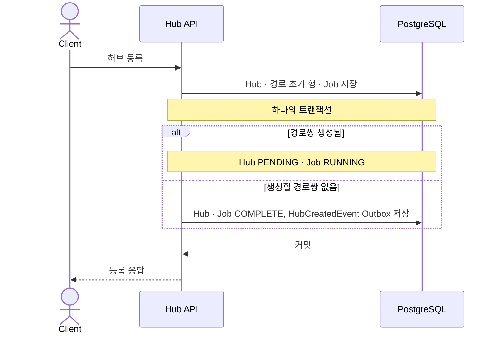
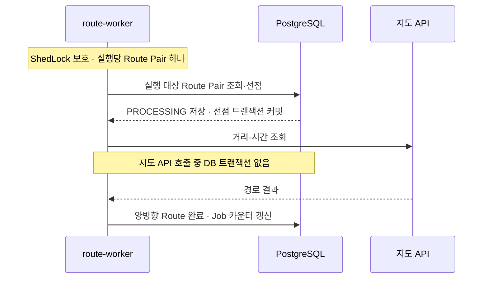
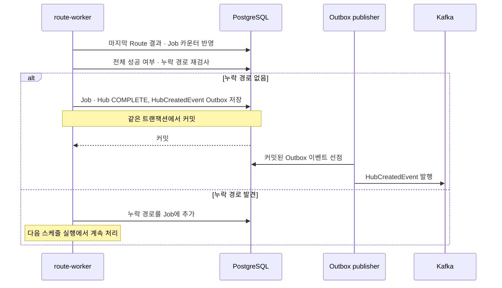
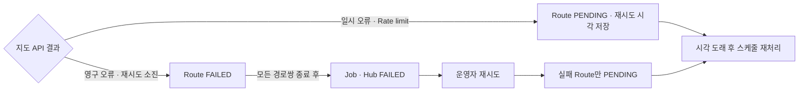

# 물류 이커머스 시스템

- 범위: 물류 허브·허브 간 이동 경로·상품 재고 관리
- 담당: Hub·HubRoute 생성·갱신 파이프라인
- 구현: DB Job 기반 비동기 처리. 장애·재시도·이벤트 전달 흐름 관리
- 스택: Java 21 · Spring Boot 3.5 · PostgreSQL 16 · Redis 7 · Kafka

## 허브 등록 요청

```mermaid
sequenceDiagram
    actor Client
    participant API as Hub API
    participant DB as PostgreSQL
    Client->>API: 허브 등록
    API->>DB: Hub · 경로 초기 행 · Job 저장
    Note over API,DB: 하나의 트랜잭션
    alt 경로쌍 생성됨
        Note over API,DB: Hub PENDING · Job RUNNING
    else 생성할 경로쌍 없음
        API->>DB: Hub · Job COMPLETE, HubCreatedEvent Outbox 저장
    end
    DB-->>API: 커밋
    API-->>Client: 등록 응답
```

## 경로쌍 구축

```mermaid
sequenceDiagram
    participant Worker as route-worker
    participant DB as PostgreSQL
    participant Map as 지도 API
    Note over Worker: ShedLock 보호 · 실행당 Route Pair 하나
    Worker->>DB: 실행 대상 Route Pair 조회·선점
    DB-->>Worker: PROCESSING 저장 · 선점 트랜잭션 커밋
    Worker->>Map: 거리·시간 조회
    Note over Worker,DB: 지도 API 호출 중 DB 트랜잭션 없음
    Map-->>Worker: 경로 결과
    Worker->>DB: 양방향 Route 완료 · Job 카운터 갱신
```

## 전체 경로 구축 성공

```mermaid
sequenceDiagram
    participant Worker as route-worker
    participant DB as PostgreSQL
    participant Publisher as Outbox publisher
    participant Kafka
    Worker->>DB: 마지막 Route 결과 · Job 카운터 반영
    Worker->>DB: 전체 성공 여부 · 누락 경로 재검사
    alt 누락 경로 없음
        Worker->>DB: Job · Hub COMPLETE, HubCreatedEvent Outbox 저장
        Note over Worker,DB: 같은 트랜잭션에서 커밋
        DB-->>Worker: 커밋
        Publisher->>DB: 커밋된 Outbox 이벤트 선점
        Publisher->>Kafka: HubCreatedEvent 발행
    else 누락 경로 발견
        Worker->>DB: 누락 경로를 Job에 추가
        Note over Worker: 다음 스케줄 실행에서 계속 처리
    end
```

완료된 Hub만 일반 조회와 배송 경로에 포함됩니다.

## 오류와 운영자 재시도

```mermaid
flowchart LR
    Error{"지도 API 결과"} -->|일시 오류 · Rate limit| Defer["Route PENDING · 재시도 시각 저장"]
    Defer --> Worker["시각 도래 후 스케줄 재처리"]
    Error -->|영구 오류 · 재시도 소진| RouteFailed["Route FAILED"]
    RouteFailed -->|모든 경로쌍 종료 후| JobHubFailed["Job · Hub FAILED"]
    JobHubFailed --> Admin["운영자 재시도"]
    Admin --> Reset["실패 Route만 PENDING"]
    Reset --> Worker
```

성공한 경로는 유지합니다. 상세 상태 전이와 재시도 정책은 [파이프라인 문서](docs/hub-route-job-pipeline.md)를 참고하세요.

## 상세 문서

- [Job·경로·Outbox 상태 전이와 재시도](docs/hub-route-job-pipeline.md)
- [센터·지점 경로 생성 정책](docs/hub-route-algorithm.md)
