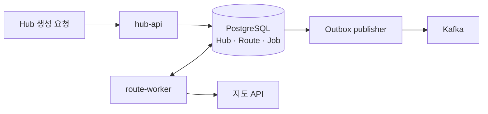
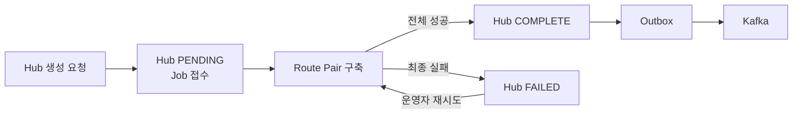

# 물류 이커머스 시스템

- 범위: 물류 허브·허브 간 이동 경로·상품 재고 관리
- 담당: Hub·HubRoute 생성·갱신 파이프라인
- 구현: DB Job 기반 비동기 처리. 장애·재시도 흐름 관리
- 스택: Java 21 · Spring Boot 3.5 · PostgreSQL 16 · Redis 7 · Kafka

## Hub 경로 생성 아키텍처


```mermaid
flowchart LR
    Client["Hub 생성 요청"] --> API["hub-api"]
    API --> DB[("PostgreSQL<br/>Hub · Route · Job")]
    Worker["route-worker"] <--> DB
    Worker --> Map["지도 API"]
    DB --> Outbox["Outbox publisher"] --> Kafka["Kafka"]
```

- Hub 생성과 경로 작업 등록을 하나의 트랜잭션으로 처리
- `route-worker`가 Route Pair를 선점해 지도 API 조회와 상태 전이를 수행
- 전체 경로가 완료되면 Outbox를 통해 변경 이벤트 발행

## 상태 한눈에 보기


```mermaid
flowchart LR
    Request["Hub 생성 요청"] --> Pending["Hub PENDING<br/>Job 접수"]
    Pending --> Build["Route Pair 구축"]
    Build -->|"전체 성공"| Complete["Hub COMPLETE"]
    Build -->|"최종 실패"| Failed["Hub FAILED"]
    Failed -->|"운영자 재시도"| Build
    Complete --> Outbox["Outbox"] --> Kafka["Kafka"]
```

참고: [상세 파이프라인 문서](docs/hub-route-job-pipeline.md#전체-상태-관계도)

## 상세 문서

- [Job·경로·Outbox 상태 전이와 재시도](docs/hub-route-job-pipeline.md)
- [센터·지점 경로 생성 정책](docs/hub-route-algorithm.md)

## 검증

### 테스트

```bash
./gradlew test
```
