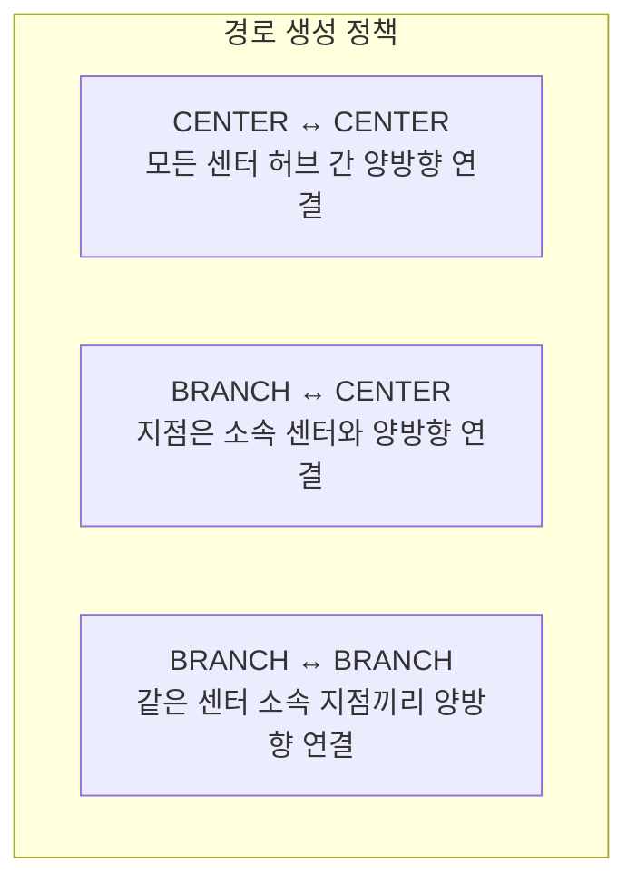
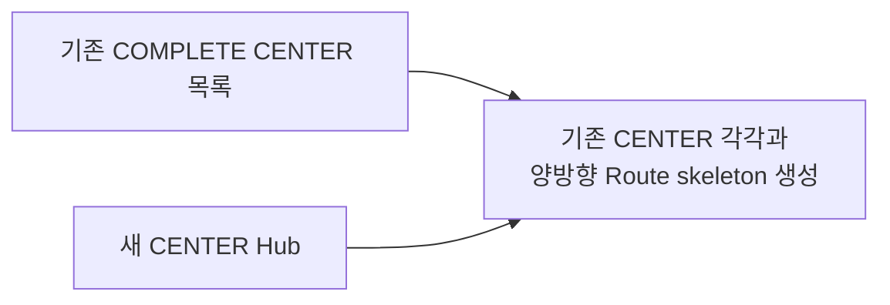
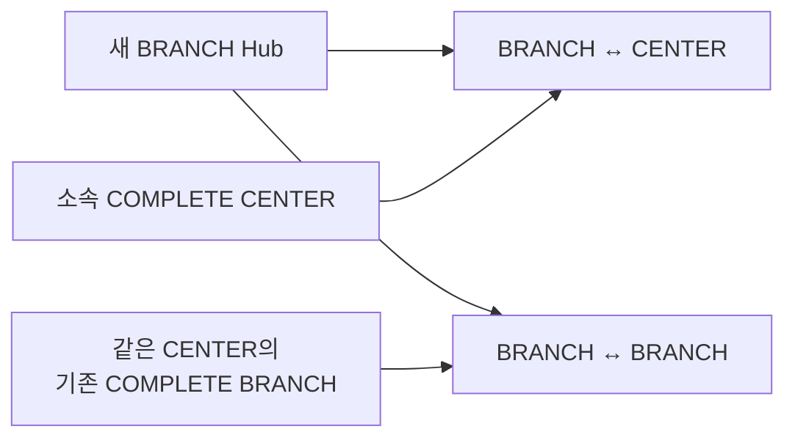

# Hub Route 생성 정책

- 범위: 새 Hub 연결 대상. 경로 topology
- 상태 전이: [Hub Route Job 파이프라인](hub-route-job-pipeline.md) 참고

## 핵심 정책

## CENTER Hub 생성

- 대상: 생성 시점 `COMPLETE` CENTER 전체
- 제외: 생성 중 Hub

## BRANCH Hub 생성

- 대상: 소속 CENTER. 같은 CENTER의 기존 `COMPLETE` BRANCH
- 제약: 소속 CENTER `COMPLETE` 전 BRANCH 생성 불가

## 저장 단위

- 저장: 양방향 Route Row 2개
- 처리: Route Pair 1개 단위. 외부 API 호출·상태 관리
- 동시성: [파이프라인 문서](hub-route-job-pipeline.md#동시성-제어와-멱등성) 참고
