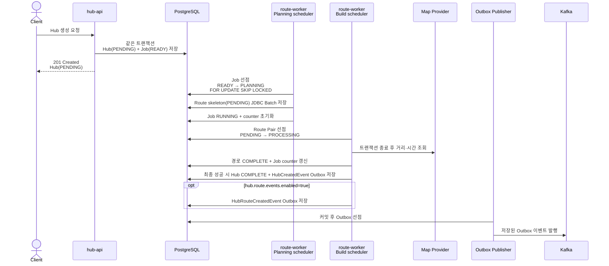
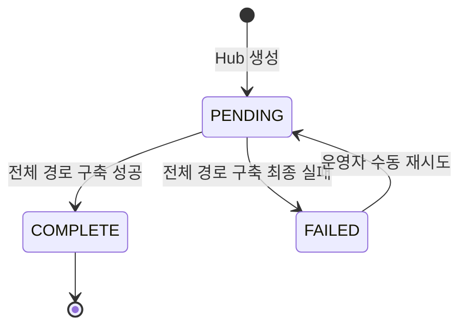
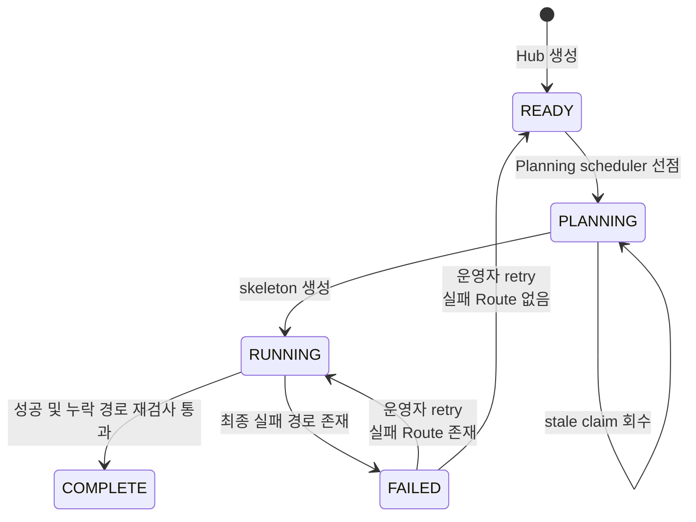
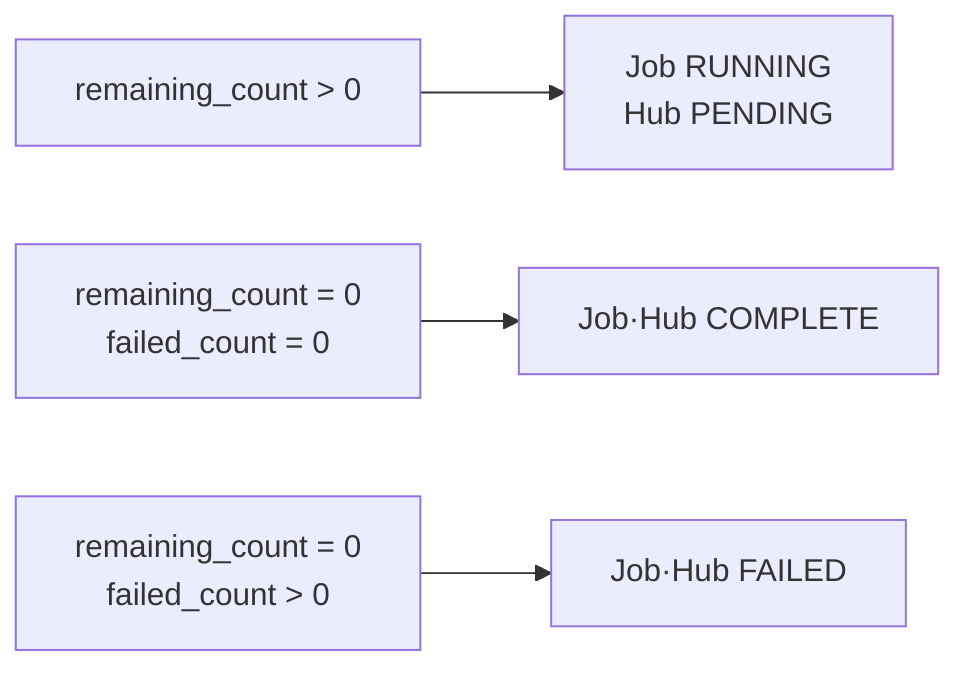
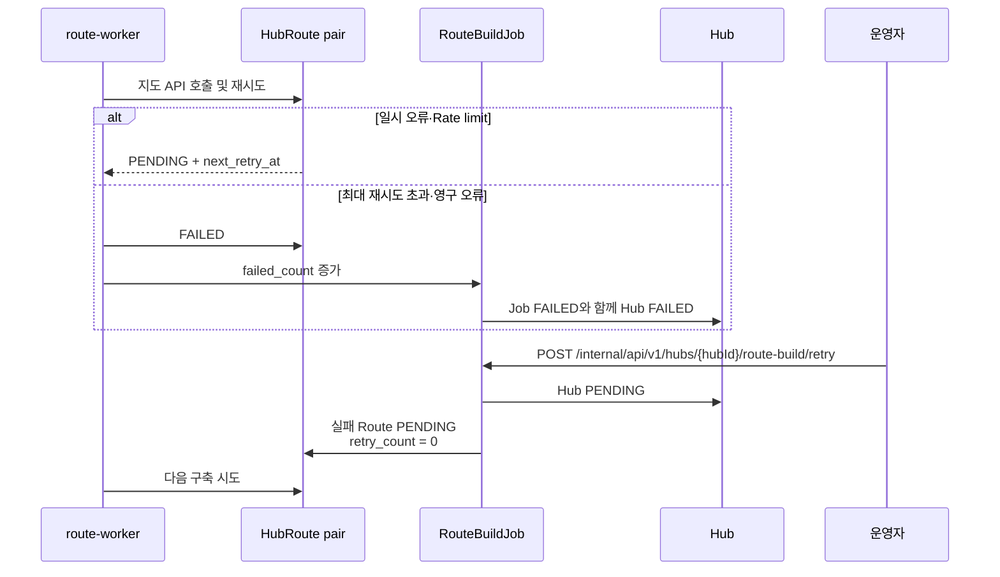
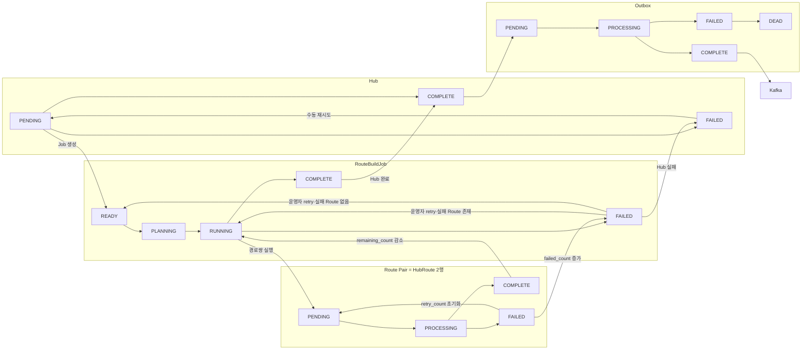
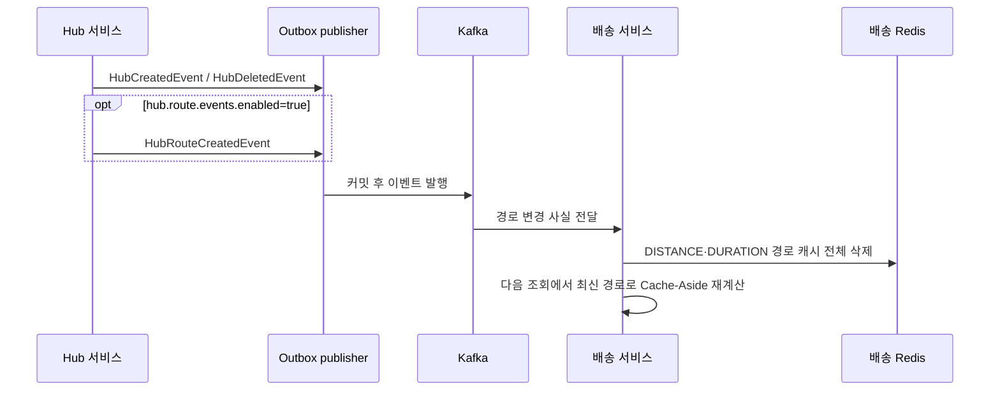

# Hub Route Job 파이프라인

## 목적

- 문제: 외부 지도 API 호출. 다수 경로 저장
- 분리: HTTP 요청은 Hub·Job 저장까지만 처리
- 관리: 경로 구축 상태와 완료 이벤트 전달 상태 분리

참고: [Hub Route 생성 정책](hub-route-algorithm.md) · [README 요약](../README.md)

## 처리 단위와 책임

- Hub: 다른 서비스 사용 가능 상태 관리
- Job: 전체 경로 구축 진행도 관리
- `HubRoute`: 한 방향 경로 구축 상태 관리
- Outbox: Hub 완료 이벤트 Kafka 전달 상태 관리

## 상태 전이

저장 단위별 상태를 분리합니다. Hub·Job·Route는 경로 구축을, Outbox는 이벤트 전달을 관리합니다.

### Hub

- `PENDING`: 일반 조회 제외. 경로 구축 대기
- `COMPLETE`: 전체 경로쌍 성공. 다른 서비스 사용 가능
- 최종 실패 → Job·Hub `FAILED`. soft delete·삭제 이벤트 미발행
- 수동 재시도 → Hub `FAILED → PENDING`

### Route Build Job

- `READY`: Planning 대기
- `PLANNING`: 연결 대상 계산. Route skeleton 저장
- `RUNNING`: Route Pair 구축
- 종료: 전체 성공 → `COMPLETE` / 최종 실패 존재 → `FAILED`
- 재시도: 내부 자동 재시도가 아니라 `POST /internal/api/v1/hubs/{hubId}/route-build/retry`로 운영자가 요청
- 재시도 후 실패 Route가 있으면 `FAILED → RUNNING`, 없으면 `FAILED → READY`

### 카운터와 상태 판정

- 집계 단위: Route Pair. 양방향 Route 두 행
- `total_count`: Job 전체 경로쌍 수
- `remaining_count`: 최종 결과 미확정 경로쌍 수
- `failed_count`: 최종 실패 경로쌍 수
- 일시 오류 재시도: 카운터 유지

최종 결과 확정 → `remaining_count - 1`. 최종 실패 → `failed_count + 1`. 수동 재시도 → 실패 Route 수를 `remaining_count`로 복원하고 `failed_count = 0`.

### HubRoute

- 저장 단위: `HubRoute` 엔티티. 처리 단위는 양방향 `HubRoute` 두 행을 묶은 Route Pair
- 선점: 두 행에 같은 processing token 기록. 소유 token만 완료·실패 처리
- `PENDING`: 최초·지연 재시도 대기
- `PROCESSING`: Worker 처리 중. stale timeout 후 재선점
- `COMPLETE`: 거리·시간·공급자 반영 완료
- `FAILED`: 최대 재시도 초과·영구 오류. 운영자 Job 재시도 시 `retry_count = 0` → `PENDING`

### Outbox Event

- `PENDING`: 트랜잭션 저장. Kafka 미발행
- `PROCESSING`: `SKIP LOCKED` 선점. stale timeout 후 재선점
- `COMPLETE`: Kafka 전송 성공
- `FAILED`: 최대 3회 재시도
- `DEAD`: 재시도 한도 소진. 운영자 확인

## 동시성 제어와 멱등성

### Job 선점

`READY` Job 1건 선점 → `FOR UPDATE SKIP LOCKED`. 잠긴 Job 건너뜀. 중복 Planning 방지.

### 경로쌍 선점

양방향 Route Row 선점 → `PROCESSING`·processing token 기록. 동일 token만 완료·실패 처리.

### 저장 멱등성

Route skeleton 저장 → JDBC batch. `(start_hub_id, end_hub_id, is_deleted)` UNIQUE + `ON CONFLICT DO NOTHING`. 완료 전 누락 경로 재계산.

## 지연·실패·재처리

- 일시 오류: Rate limit·Timeout·5xx → backoff·최대 재시도
- Provider: Kakao 실패 → 조건에 따라 Naver fallback
- Worker 중단: stale `PLANNING` Job·`PROCESSING` Route → 다음 scheduler가 재선점

## 실행 프로필

- `hub-api`: HTTP API. Hub·Job 생성. Outbox 재발행
- `route-worker`: Planning·Build scheduler. 외부 지도 API 호출. Hub 완료 전환
- 실행 단위: Planning·Build는 같은 `route-worker` 프로세스
- 프로세스: `hub-api`와 `route-worker`는 같은 JAR을 서로 다른 Spring profile로 실행

## 전체 상태 관계도

아래 그림은 앞선 상태 설명을 한 흐름으로 묶은 참고도입니다. README에는 핵심 흐름만 표시하고, 상세 상태와 카운터는 이 문서에서 설명합니다.

## 배송 서비스 캐시 갱신 정책

- Hub는 배송 서비스의 캐시 키·TTL·재계산 방식을 알지 않음
- 배송 서비스는 이벤트 소비 후 캐시 무효화를 결정함
- 현재 최단 경로 캐시는 Redis Hash에 저장하고 TTL은 30일임
- 기본 `route-worker` 프로필은 `hub.route.events.enabled=false`이므로 Route worker의 경로 생성·갱신 이벤트는 기본적으로 Outbox에 저장되지 않음
- `HubRouteDeletedEvent` 발행 메서드와 이벤트 리스너 테스트는 존재하지만, 현재 허브 삭제 운영 경로에서 해당 이벤트를 발행하는 호출부는 확인되지 않음
