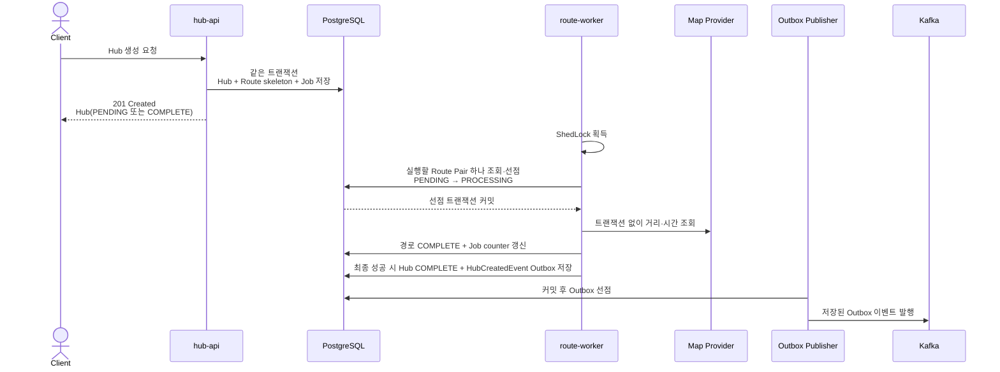
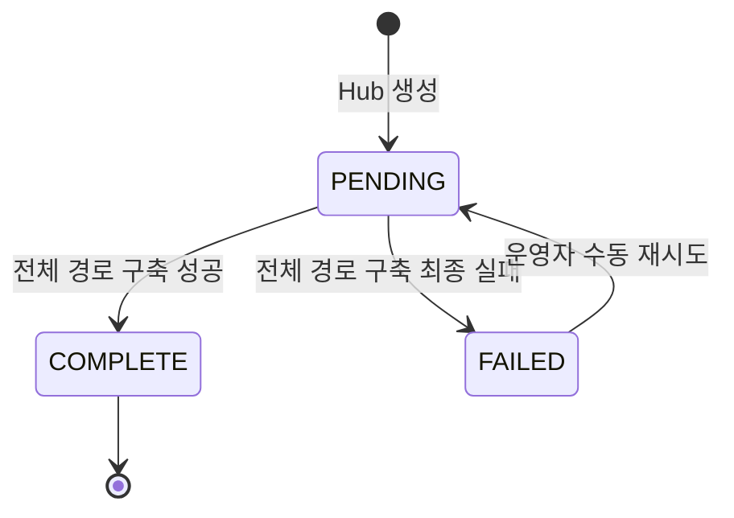
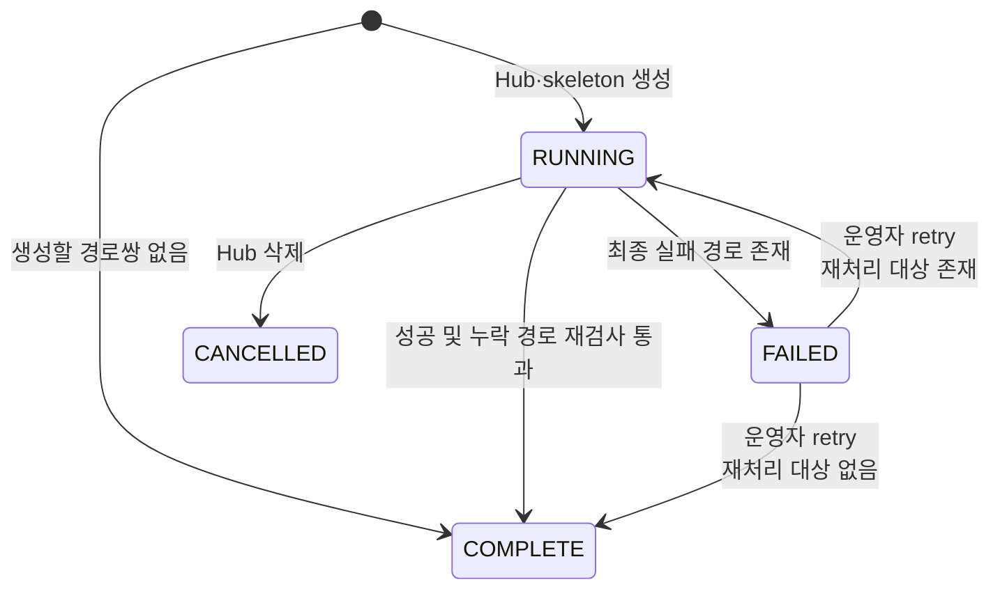
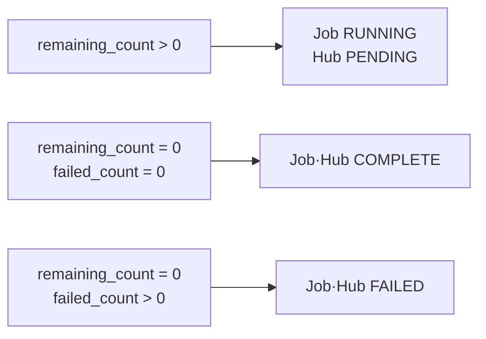
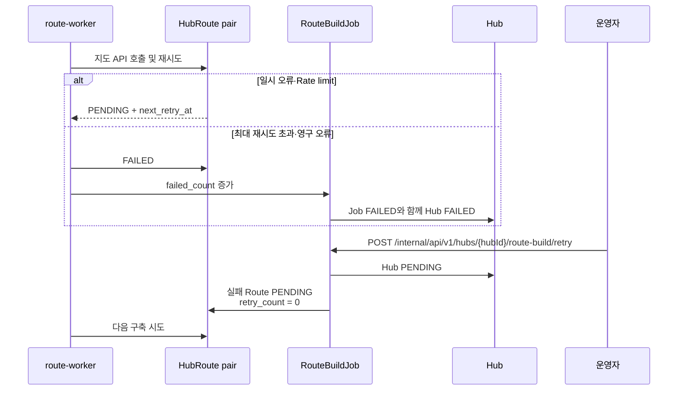
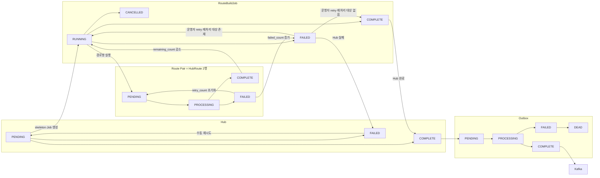
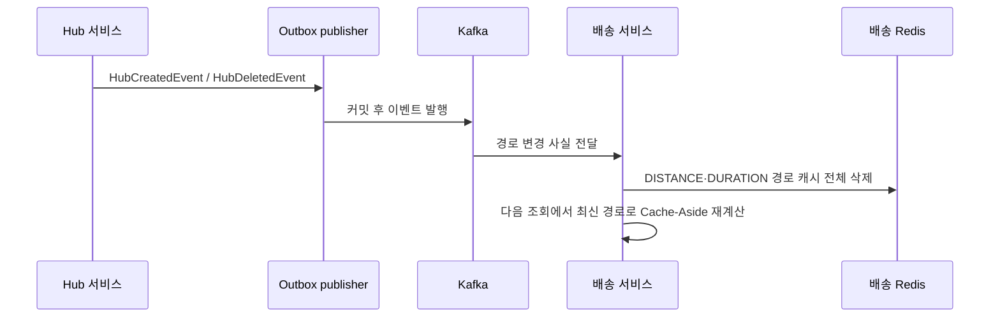

# Hub Route Job 파이프라인

## 목적

- 문제: 외부 지도 API 호출. 다수 경로 저장
- 분리: HTTP 요청은 Hub·Route skeleton·Job 저장까지 처리하고 지도 API 호출은 Worker가 수행
- 관리: 경로 구축 상태와 완료 이벤트 전달 상태 분리

참고: [Hub Route 생성 정책](hub-route-algorithm.md) · [README 요약](../README.md)

```mermaid
sequenceDiagram
    actor Client
    participant API as hub-api
    participant DB as PostgreSQL
    participant Worker as route-worker
    participant Map as Map Provider
    participant Publisher as Outbox Publisher
    participant Kafka

    Client->>API: Hub 생성 요청
    API->>DB: 같은 트랜잭션<br/>Hub + Route skeleton + Job 저장
    API-->>Client: 201 Created<br/>Hub(PENDING 또는 COMPLETE)
    Worker->>Worker: ShedLock 획득
    Worker->>DB: 실행할 Route Pair 하나 조회·선점<br/>PENDING → PROCESSING
    DB-->>Worker: 선점 트랜잭션 커밋
    Worker->>Map: 트랜잭션 없이 거리·시간 조회
    Worker->>DB: 경로 COMPLETE + Job counter 갱신
    Worker->>DB: 최종 성공 시 Hub COMPLETE + HubCreatedEvent Outbox 저장
    Publisher->>DB: 커밋 후 Outbox 선점
    Publisher->>Kafka: 저장된 Outbox 이벤트 발행
```

## 처리 단위와 책임

- Hub: 다른 서비스 사용 가능 상태 관리
- Job: 전체 경로 구축 진행도 관리
- `HubRoute`: 한 방향 경로 구축 상태 관리
- Outbox: Hub 완료 이벤트 Kafka 전달 상태 관리

## 상태 전이

저장 단위별 상태를 분리합니다. Hub·Job·Route는 경로 구축을, Outbox는 이벤트 전달을 관리합니다.

### Hub

```mermaid
stateDiagram-v2
    [*] --> PENDING: Hub 생성
    PENDING --> COMPLETE: 전체 경로 구축 성공
    PENDING --> FAILED: 전체 경로 구축 최종 실패
    FAILED --> PENDING: 운영자 수동 재시도
    COMPLETE --> [*]
```

- `PENDING`: 일반 조회 제외. 경로 구축 대기
- `COMPLETE`: 전체 경로쌍 성공. 다른 서비스 사용 가능
- 최종 실패 → Job·Hub `FAILED`. soft delete·삭제 이벤트 미발행
- 수동 재시도 → Hub `FAILED → PENDING`

### Route Build Job

```mermaid
stateDiagram-v2
    [*] --> RUNNING: Hub·skeleton 생성
    [*] --> COMPLETE: 생성할 경로쌍 없음
    RUNNING --> COMPLETE: 성공 및 누락 경로 재검사 통과
    RUNNING --> FAILED: 최종 실패 경로 존재
    FAILED --> RUNNING: 운영자 retry<br/>재처리 대상 존재
    FAILED --> COMPLETE: 운영자 retry<br/>재처리 대상 없음
    RUNNING --> CANCELLED: Hub 삭제
```

- `RUNNING`: Route Pair 구축
- 생성할 Route Pair가 없으면 Job과 Hub를 요청 트랜잭션에서 바로 `COMPLETE`로 전환
- 종료: 전체 성공 → `COMPLETE` / 최종 실패 존재 → `FAILED`
- 재시도: 내부 자동 재시도가 아니라 `POST /internal/api/v1/hubs/{hubId}/route-build/retry`로 운영자가 요청
- 재시도 후 처리할 Route가 있으면 `FAILED → RUNNING`, 없으면 누락 경로 재검사 후 `COMPLETE`

### 카운터와 상태 판정

- 집계 단위: Route Pair. 양방향 Route 두 행
- `total_count`: Job 전체 경로쌍 수
- `remaining_count`: 최종 결과 미확정 경로쌍 수
- `failed_count`: 최종 실패 경로쌍 수
- 일시 오류 재시도: 카운터 유지

```mermaid
flowchart LR
    More["remaining_count > 0"] --> Running["Job RUNNING<br/>Hub PENDING"]
    Done["remaining_count = 0<br/>failed_count = 0"] --> Complete["Job·Hub COMPLETE"]
    Failed["remaining_count = 0<br/>failed_count > 0"] --> FinalFailed["Job·Hub FAILED"]
```

최종 결과 확정 → `remaining_count - 1`. 최종 실패 → `failed_count + 1`. 수동 재시도 → 실패 Route 수를 `remaining_count`로 복원하고 `failed_count = 0`.

### HubRoute

- 저장 단위: `HubRoute` 엔티티. 처리 단위는 양방향 `HubRoute` 두 행을 묶은 Route Pair
- 선점: 양방향 두 행을 잠근 뒤 `PROCESSING`으로 전환. 실행별 처리 토큰은 저장하지 않음
- `PENDING`: 최초·지연 재시도 대기
- `PROCESSING`: Worker 처리 중. stale timeout 후 재선점
- `COMPLETE`: 거리·시간·공급자 반영 완료
- `FAILED`: 최대 재시도 초과·영구 오류. 운영자 Job 재시도 시 `retry_count = 0` → `PENDING`

### Outbox Event

- `PENDING`: 트랜잭션 저장. Kafka 미발행
- `PROCESSING`: `SKIP LOCKED` 선점. stale timeout 후 재선점
- `COMPLETE`: Kafka 전송 성공
- `FAILED`: 최대 3회 재시도
- `DEAD`: 재시도 한도 소진. 운영자 확인

## 동시성 제어와 중복 실행 대응

### 경로 계획 직렬화

Hub 생성 트랜잭션에서 advisory lock을 획득한 뒤 최신 topology를 기준으로 Route skeleton을 저장합니다. 동시에 생성되는 Hub가 서로를 누락하지 않도록 계획 구간만 직렬화합니다.

### 단일 경로쌍 처리

스케줄 실행은 ShedLock으로 보호합니다. 한 번의 실행에서 Route Pair 하나를 동기 처리하며, 경로 구축용 별도 스레드풀은 사용하지 않습니다. 여러 `route-worker` 인스턴스가 실행돼도 유효한 ShedLock을 가진 스케줄 실행 하나만 진행합니다.

선점·결과 반영은 각각 짧은 DB 트랜잭션으로 처리합니다. 선점 시 양방향 Route 행을 `PESSIMISTIC_WRITE`로 잠그고 `PROCESSING`으로 전환합니다. 지도 API 호출 중에는 DB 트랜잭션을 유지하지 않습니다.

경로 구축 기본 설정은 ShedLock lease 6분, `PROCESSING` stale 기준 7분입니다. Worker가 중단되면 stale 기준을 넘긴 Route Pair를 다음 스케줄 실행이 다시 선점합니다. 두 시간이 지난 뒤 기존 호출이 아직 진행 중이면 지도 API 요청이 겹칠 수 있습니다. 처리 토큰 없이 Route 행 잠금과 상태 전이로 결과를 반영하며, 이미 완료된 Pair의 중복 완료 결과는 Job 카운터를 다시 감소시키지 않습니다.

### 저장 멱등성

Route skeleton 저장 → JDBC batch. `(start_hub_id, end_hub_id, is_deleted)` UNIQUE + `ON CONFLICT DO NOTHING`. 완료 전 누락 경로 재계산.

## 지연·실패·재처리

```mermaid
sequenceDiagram
    participant Worker as route-worker
    participant Route as HubRoute pair
    participant Job as RouteBuildJob
    participant Hub as Hub
    participant Operator as 운영자

    Worker->>Route: 지도 API 호출 및 재시도
    alt 일시 오류·Rate limit
        Route-->>Worker: PENDING + next_retry_at
    else 최대 재시도 초과·영구 오류
        Worker->>Route: FAILED
        Worker->>Job: failed_count 증가
        Job->>Hub: Job FAILED와 함께 Hub FAILED
    end
    Operator->>Job: POST /internal/api/v1/hubs/{hubId}/route-build/retry
    Job->>Hub: Hub PENDING
    Job->>Route: 실패 Route PENDING<br/>retry_count = 0
    Worker->>Route: 다음 구축 시도
```

- 일시 오류: Rate limit·Timeout·5xx → backoff·최대 재시도
- Provider: Kakao 실패 → 조건에 따라 Naver fallback
- Worker 중단: stale `PROCESSING` Route Pair → 다음 스케줄 실행에서 재선점

## 전체 상태 관계도

아래 그림은 앞선 상태 설명을 한 흐름으로 묶은 참고도입니다. README에는 핵심 흐름만 표시하고, 상세 상태와 카운터는 이 문서에서 설명합니다.

```mermaid
flowchart LR
    subgraph H["Hub"]
        HP["PENDING"] --> HC["COMPLETE"]
        HP --> HF["FAILED"]
        HF -->|"수동 재시도"| HP
    end

    subgraph J["RouteBuildJob"]
        JW["RUNNING"]
        JW --> JC["COMPLETE"]
        JW --> JF["FAILED"]
        JF -->|"운영자 retry·재처리 대상 존재"| JW
        JF -->|"운영자 retry·재처리 대상 없음"| JC
        JW --> JX["CANCELLED"]
    end

    subgraph R["Route Pair = HubRoute 2행"]
        RP["PENDING"] --> RX["PROCESSING"] --> RC["COMPLETE"]
        RX --> RF["FAILED"]
        RF -->|"retry_count 초기화"| RP
    end

    subgraph O["Outbox"]
        OP["PENDING"] --> OX["PROCESSING"] --> OC["COMPLETE"]
        OX --> OF["FAILED"] --> OD["DEAD"]
    end
    Kafka["Kafka"]

    HP -->|"skeleton·Job 생성"| JW
    JW -->|"경로쌍 실행"| RP
    RC -->|"remaining_count 감소"| JW
    RF -->|"failed_count 증가"| JF
    JF -->|"Hub 실패"| HF
    JC -->|"Hub 완료"| HC
    HC --> OP
    OC --> Kafka
```

## 배송 서비스 캐시 갱신 정책

```mermaid
sequenceDiagram
    participant Hub as Hub 서비스
    participant Outbox as Outbox publisher
    participant Kafka
    participant Shipping as 배송 서비스
    participant Redis as 배송 Redis

    Hub->>Outbox: HubCreatedEvent / HubDeletedEvent
    Outbox->>Kafka: 커밋 후 이벤트 발행
    Kafka->>Shipping: 경로 변경 사실 전달
    Shipping->>Redis: DISTANCE·DURATION 경로 캐시 전체 삭제
    Shipping->>Shipping: 다음 조회에서 최신 경로로 Cache-Aside 재계산
```

- Hub는 배송 서비스의 캐시 키·TTL·재계산 방식을 알지 않음
- 배송 서비스는 이벤트 소비 후 캐시 무효화를 결정함
- 현재 최단 경로 캐시는 Redis Hash에 저장하고 TTL은 30일임
