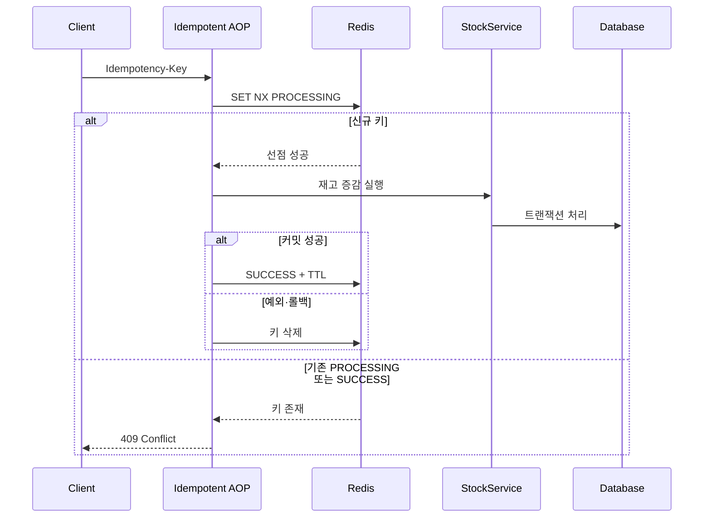

# 재고 변경 요청의 멱등성

- 대상: 재고 증감 API. Hub 경로 생성과 별개
- 위치: `StockService` 증가·감소 메서드
- 방식: `@Idempotent` AOP

## 처리 시퀀스

- 멱등키: 메서드 첫 번째 파라미터
- `PROCESSING` TTL: 300초
- `SUCCESS` TTL: 24시간
- 중복 요청: `409 Conflict`. 성공 응답 재생 미지원

## 범위와 한계

- 한계: DB 커밋 후 Redis 상태 기록 실패 가능
- 보완: 재고 이력 DB UNIQUE 제약 병행
